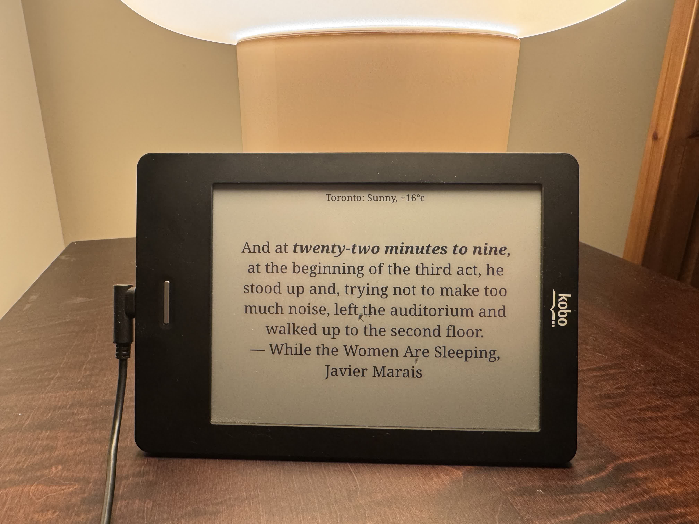
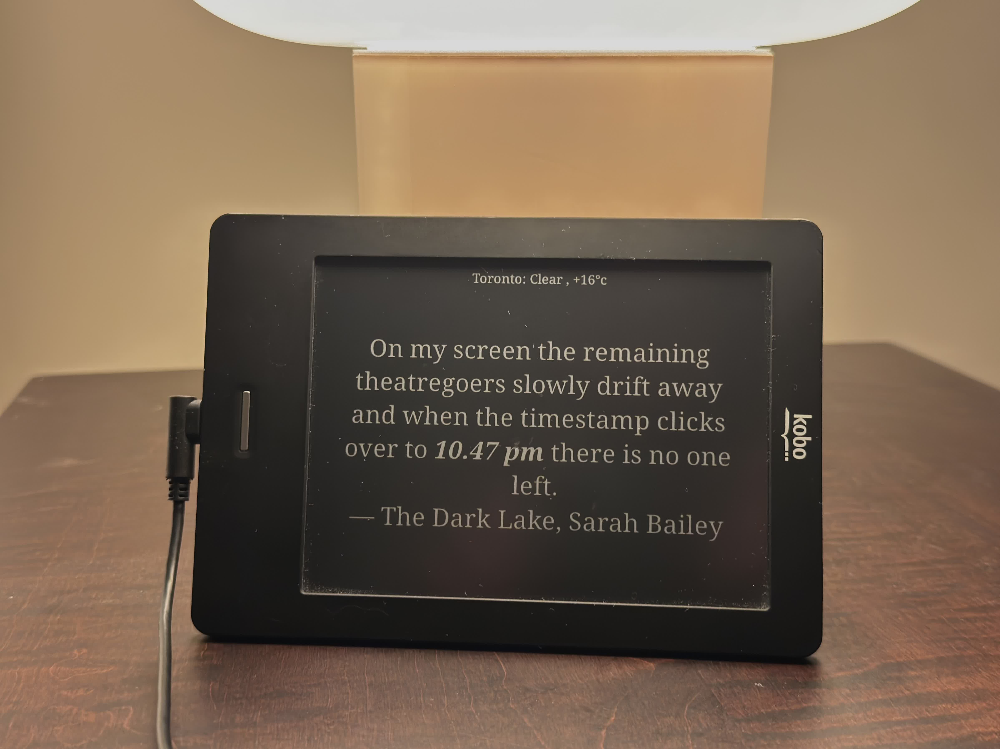

# Literary Clock

I took my old Kobo eReader and repurposed it into a literary clock that displays real book quotes matching the current time. Each minute, the screen updates with a random quote containing that exact time, rendered cleanly on the eInk display.

The setup is not permanent, removing the startup commands, followed with a reboot will return the Kobo to its normal state.

## Overview

This project turns a Kobo device into a minimalist clock powered by literature.

- Uses a dataset of **3000+ time-tagged quotes**
- Covers all **1440 minutes** in a day
- Displays text using **FBInk** directly to the framebuffer
- Updates automatically every minute
- Optional tap input cycles between multiple quotes for the same time
- Displays the **weather** of the specified city

<div align="center">
<table>
  <tr>
    <td></td>
    <td></td>
  </tr>
</table>
<em>Ignore the dead pixels in the center. The screen was damaged when the unit was dropped.</em>
</div>

---

## Device

- **Model:** Kobo Touch N905C (Trilogy @ Mark 4)
- **CPU:** i.MX507 ARMv7
- **Screen:** 600x800 eInk, 167 dpi
- **Kernel:** Linux 2.6.35.3 (BusyBox v1.35.99.139-g15f7d618e)
- **Extra SD Card** 32 GB (Capacity is overkill)

---

## How It Works

On boot, the device runs a udev hook (provided by NiLuJe's usbnet package). This launches `litclock-start.sh`, which waits for the SD card to mount, kills the Kobo UI (nickel), and starts the clock script. The clock script reads `quotes.csv` every minute, finds a matching literary quote for the current time, and renders it to the eInk screen using FBInk.

1. A udev hook runs `stuff.sh`
2. This launches `litclock-start.sh`
3. The script:
   - Waits for the SD card to mount
   - Stops the Kobo UI (`nickel`)
   - Starts the clock loop

The main script:

- Reads `quotes.csv`
- Matches the current time (HH:MM)
- Renders a quote using `FBInk`
  - Refreshes every minute
- Retrieves/renders the weather of the specified city from `wttr.in`
  - Refreshes every hour

---

## File Layout

Easier to use a SD card due to the limited onboard memory
| File | Location | Description |
|------|----------|-------------|
| Main clock script | `/mnt/sd/litclock.sh` | The main clock loop |
| Touch watcher | `/mnt/sd/touch_watcher` | Processes touch screen events (compiled from `touch_watcher.c`) |
| Respawn supervisor | `/mnt/sd/litclock-run.sh` | Restarts the clock or watcher if either dies |
| Quotes database | `/mnt/sd/quotes.csv` | Time-tagged literary quotes |
| Boot entry point | `/usr/local/stuff/bin/stuff.sh` | Runs at boot via udev |
| Boot launcher | `/usr/local/stuff/bin/litclock-start.sh` | Waits for SD, kills nickel, starts clock |
| FBInk binary | `/mnt/sd/koreader/fbink` | Writes text to the eInk framebuffer |
| Fonts | `/mnt/sd/koreader/fonts/noto/` | NotoSerif Regular/Bold/Italic/BoldItalic |

---

## Key Commands

### Manually start the clock (from telnet/SSH)

```sh
killall nickel 2>/dev/null
killall sickel 2>/dev/null
killall sickel-launcher 2>/dev/null
killall litclock-run.sh 2>/dev/null
killall touch_watcher 2>/dev/null
killall litclock.sh 2>/dev/null

mount -o remount,rw /mnt/sd

setsid nohup /mnt/sd/litclock-run.sh /mnt/sd/touch_watcher > /dev/null 2>&1 &
setsid nohup /mnt/sd/litclock-run.sh /mnt/sd/litclock.sh 2>> /tmp/litclock.log &
```

Kill `litclock-run.sh` first — it is the supervisor, and it will otherwise
restart whatever you just killed.

### Check if the clock is running

```sh
ps | grep litclock
```

### Remount SD card as writable (if needed)

```sh
mount -o remount,rw /mnt/sd
```

> The SD card mounts read-only by default. You must remount it before writing or editing any files on it.

### Update the clock script or quotes

```sh
make deploy KOBO=192.168.1.42
```

This validates the dataset and syntax-checks the scripts before pushing
anything, which matters here because a malformed `quotes.csv` line fails
silently on the device. To copy a single file by hand:

```sh
scp litclock.sh root@KOBO_IP:/mnt/sd/litclock.sh
scp quotes.csv root@KOBO_IP:/mnt/sd/quotes.csv
```

Changes take effect on the next minute cycle — no reboot needed.

### Check the quotes dataset

```sh
make check
```

Verifies that every row has five fields, that the timestamp parses, that the
time phrase actually occurs in the quote (otherwise the highlight silently does
nothing), and reports which minutes have no quote.

### Preview the clock without the device

```sh
make preview
```

Runs the real `litclock.sh` loop with a stubbed `fbink` that prints to the
terminal, so selection, highlighting, font sizing and night mode can be checked
on a workstation. `litclock.sh` honours `LITCLOCK_FBINK`, `LITCLOCK_CSV` and
`LITCLOCK_FONTS` for this.

---

## quotes.csv Format

The CSV uses `|` as a separator with five columns:

```
HH:MM|time phrase|full quote text|Book Title|Author Name
```

Example:

```
13:00|one o'clock|Czarina Catherine reported entering Galatz at one o'clock today.|Dracula|Bram Stoker
```

---

## Extra Fonts

You can try more fonts by adding them to the /mnt/sd/fonts and altering the font constants in `litclock.sh`

- `$REGULAR`
- `$BOLD`
- `$ITALIC`
- `$BOLDITALIC`

---

## Weather

Above the quote, the weather for the specified city is displayed (if the
`wttr.in` API is reachable) and cached to `/tmp/weather_cache.txt`. Change
`$CITY` in `litclock.sh` to view the weather for a different city.

The reading is refetched once per wall-clock hour and kept on screen for up to
`$WEATHER_TTL` (3h) afterwards, so a brief WiFi dropout does not blank it.

---

## Touch Watcher

If other quotes are available at the current time, `touch_watcher` (compiled
from `touch_watcher.c`) polls `/dev/input/event1` for touch-down events. When
the screen is tapped, it creates a refresh signal (`/tmp/litclock_refresh`),
prompting the clock to draw a different quote for the same minute — never the
one already on screen. It debounces for 2s so a single touch fires once.

`touch_watcher.sh` is an earlier shell implementation using blocking `dd` reads.
It is kept for reference; the compiled watcher is what runs.

Build the watcher with an ARM cross-compiler:

```sh
make watcher CC=arm-linux-musleabihf-gcc
```

---

## Orientation

By sending the `2` to the system file `/sys/class/graphics/fb0/rotate` we can control the orientation of the framebuffer. This command is sent on startup in `litclock-start.sh`.

If your Kobo can support a newer version of `fbink` you can adjust the rotation `fbink -r` rather than adjusting the framebuffer below.

```sh
# Set landscape rotation
echo 2 > /sys/class/graphics/fb0/rotate
```

---

## Boot Chain

```
udev (loop0 event)
  └── /usr/local/stuff/bin/stuff.sh
        └── /usr/local/stuff/bin/litclock-start.sh  (backgrounded with setsid)
              ├── waits for /mnt/sd to mount
              ├── sleeps 15s for nickel to start
              ├── killall nickel / sickel / sickel-launcher
              ├── mount -o remount,rw /mnt/sd
              ├── setsid nohup litclock-run.sh /mnt/sd/touch_watcher &
              └── setsid nohup litclock-run.sh /mnt/sd/litclock.sh &
```

---

## Burn-in / Ghosting Prevention

The script performs a full flashing screen refresh (`fbink -f -k`) every 5 minutes to clear eInk ghosting. This is normal — the screen will flash black briefly then return to the quote.

The interval is keyed to the wall clock, not to loop iterations, so tapping the
screen repeatedly does not drag the flash forward.

---

## Reliability

`litclock-run.sh` supervises both the clock loop and the touch watcher,
restarting either one if it exits, with exponential backoff capped at 60s and a
line in `/tmp/litclock.log` each time. A frozen eInk screen is indistinguishable
from a working one, so without this a crash is invisible.

---

## Required Packages

### NiLuJe's USB Net / Telnet / SSH package

**https://www.mobileread.com/forums/showthread.php?t=254214**

- Necessary for telnet and SSH access to the device
- Contains FBInk — the binary responsible for writing custom quotes to the eInk screen
- Provides the `stuff.sh` udev boot hook used for autostart
- Install by copying `KoboRoot.tgz` to `/mnt/onboard/.kobo/` and rebooting
- Does **not** touch `rcS`, `inittab`, or any system files! I learned that the hard way.

---

## Kobo Firmware Archive

**https://pgaskin.net/KoboStuff/kobofirmware.html**

Historical Kobo firmware versions for all devices. Useful if you need to restore or identify the correct firmware version for your device.

---

## Warnings & Gotchas

- **Do NOT press Home + Power together** — this triggers the recovery partition (sda2) which reformats sda1 and wipes all your changes
- **Do NOT put untested KoboRoot.tgz files in `.kobo/`** — a bad rcS will cause a boot loop that requires manually mounting sda1 on a PC to fix
- **The SD card mounts read-only** — always run `mount -o remount,rw /mnt/sd` before editing files on it
- **hindenburg** is the watchdog binary that monitors nickel— do not delete it or the device will reboot after ~1 minute

---

## More E-reader Jailbreaks

If you need more e-reader hacks, tools, and community support:

**https://www.mobileread.com/**

---

## License

The **code** (scripts, `touch_watcher.c`, tooling) is MIT.

The **quote dataset** (`quotes.csv`) is not, and cannot be — it descends from
the Guardian's crowd-sourced collection and stays under CC BY-NC-SA 2.5:
non-commercial, share-alike, attribution required. Reuse it on those terms.

See [LICENSE](LICENSE) for the full text and for the third-party files.

---

## Credits

- **FBInk** by NiLuJe — eInk framebuffer writing library
- **Literary clock quotes** based on Jaap Meijers's dataset, originally
  crowd-sourced by the Guardian and licensed CC BY-NC-SA 2.5. Gaps filled from
  the community forks that extend it:
  [JohannesNE/literature-clock](https://github.com/JohannesNE/literature-clock),
  [cdmoro/literature-clock](https://github.com/cdmoro/literature-clock) and
  [kapoorankush/litclock](https://github.com/kapoorankush/litclock)
- **NiLuJe's usbnet/KoboStuff package** — telnet, SSH, and boot hook infrastructure
- **KoReader** — provided the pre-compiled FBInk binary and NotoSerif fonts
